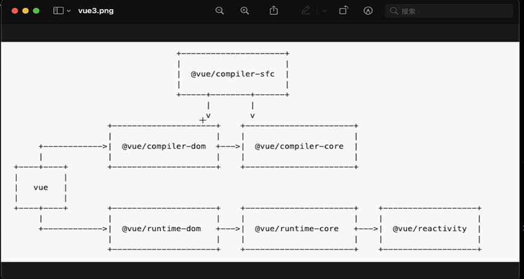

# 从 vue 文件体系看 vue 的模块划分

## 上图

## 详解

- vue 平常用的核心模块,基本只是一个出口/桶文件

  - compiler 系列
    - -dom 处理 template
    - -core 被 dom 依赖
    - 以及横跨两者的-sfc，专门用于解析 sfc
  - runtime 系列
    - -dom 面向 dom 平台
    - -core 无关平台的 runtime 逻辑，被 dom 依赖
    - -reactivity 响应式实现，自成一体，可以单独用

- sfc 与 rollup
  - 借助 rollup-plugin-vue 和 sfc 模块
  - 我们可以单独的写.vue 文件然后进行编译为 js 代码
- compiler 的其他模块
  - 主要是把 tempalte 处理为 render 函数
  - 注意区分把 sfc 转为 js 代码以及 template 代码转为 render 函数是不同的两个部分
